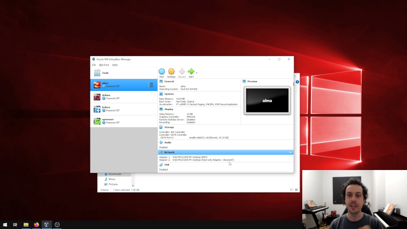
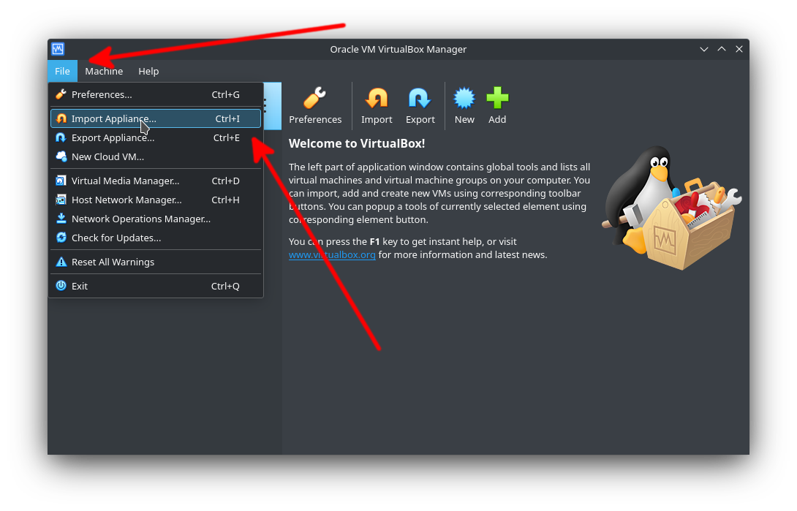
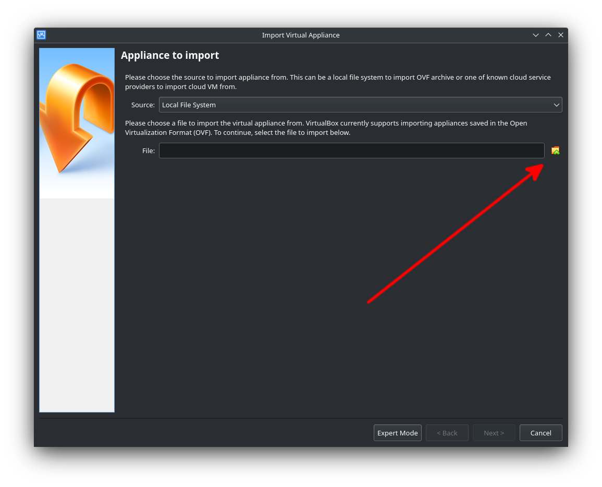
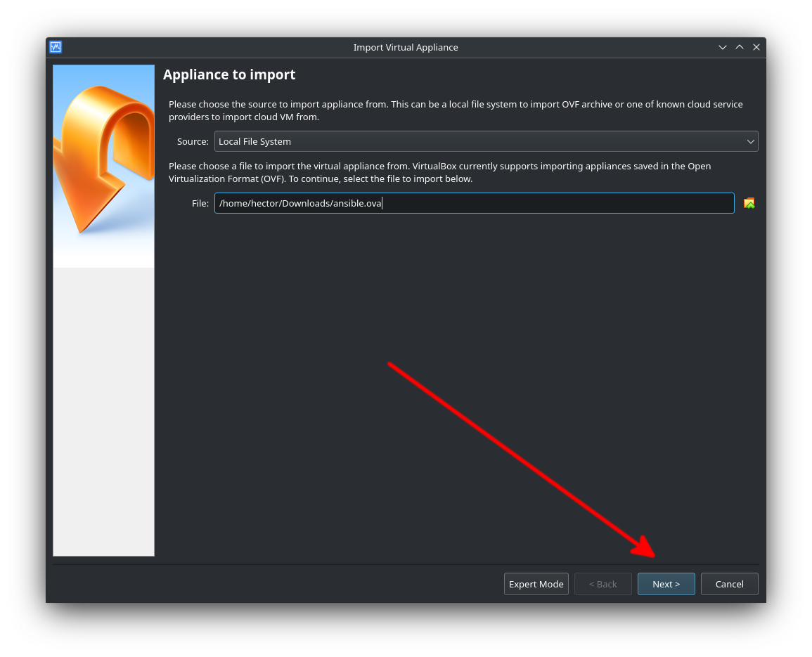
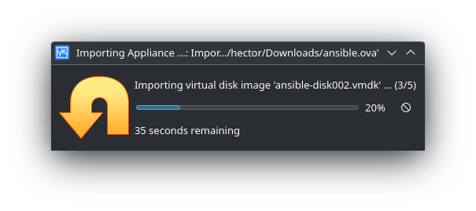
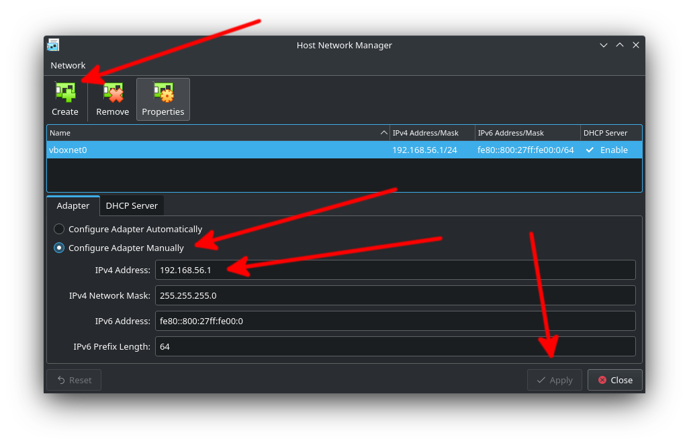
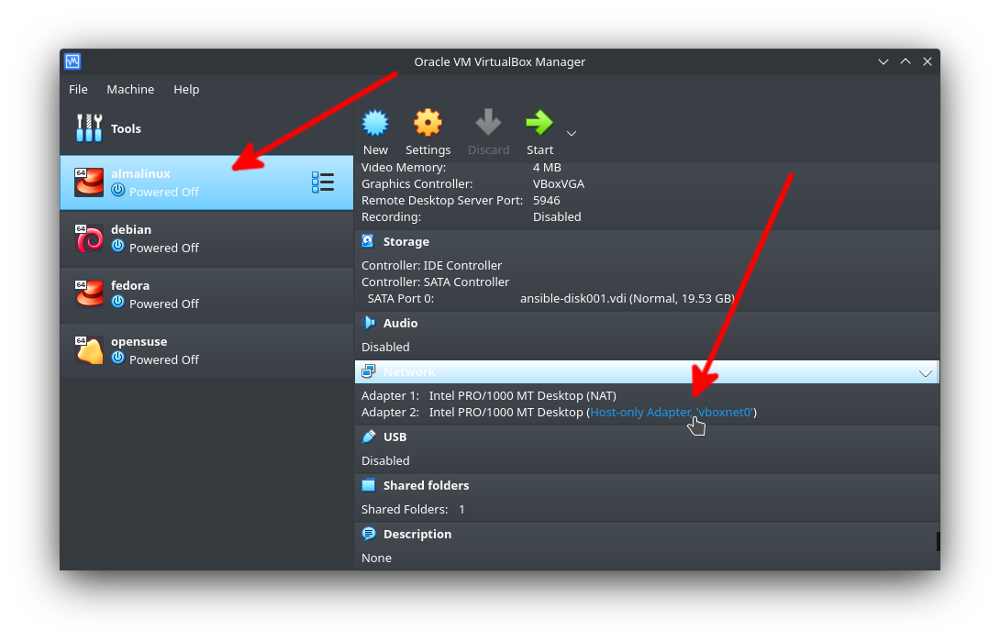
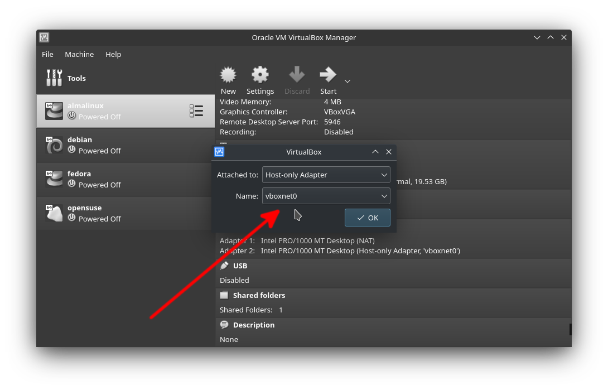
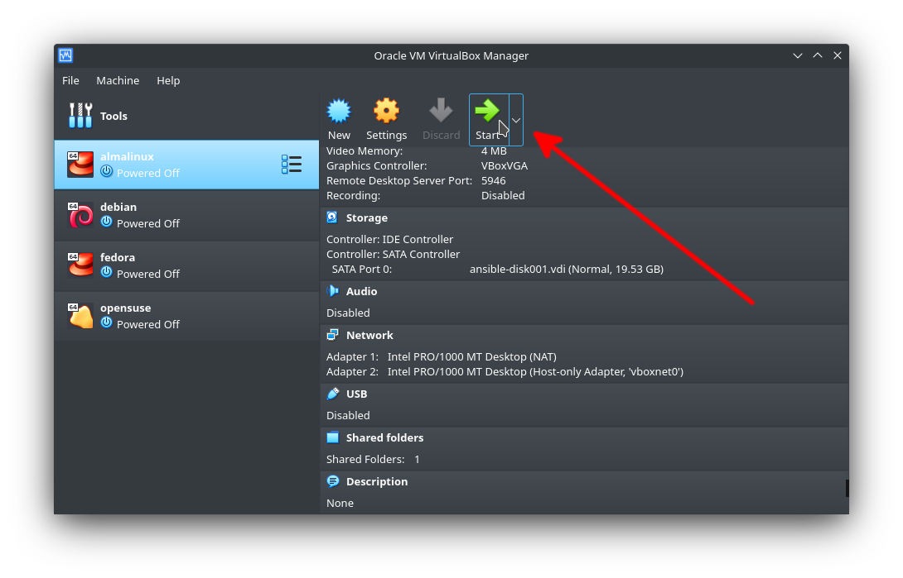

# NIC.br Ansible - ansible.ova

Baixe o arquivo [ansible.ova](https://drive.google.com/drive/folders/17VoBJWpPRFIUTtho1XTtrEhMKQHaOg7F) em seu computador.

Um arquivo `.ova` é um pacote com definições e discos de máquinas virtuais. Neste nosso caso haverão quatro máquinas dentro deste arquivo.

É possível abrir arquivos `.ova` em vários hypervisors, convertê-los ou extraí-los para utilizar em outros mais, mas neste nosso caso o foco será única e exclusivamente o VirtualBox.

Três passos serão necessários para conseguirmos acesso as máquinas:

- Baixar o arquivo
- Importar o arquivo dentro do VirtualBox
- Criar uma interface de rede para `192.168.56.0/24`

## Configurando o ambiente

1. Importe as máquinas cliando no menu "Arquivo -> Importar Applicance":

2. Clique no ícone do diretório para abrir o explorador de arquivos:

3. Selecione o arquivo `ansible.ova` e clique em "Abrir":

4. Clique em "Avançar":

5. Clique em "Importar":

6. Espere a importação, dependendo da máquina física isso pode levar alguns minutos:

7. Esta são as máquinas importadas:

8. Clique em "Arquivo -> Gerenciador da Rede Hospedeira":

9. Adicionar rede

Muitas vezes a interface de rede já existe por padrão dentro do VirtualBox, seu nome não importa, o que importa é o seu endereço IPv4. É possível adicionar uma nova interface ou modificar uma existente, isso fica a seu critério.

O endereço IPv4 deve ser `192.168.56.1` e a máscara de rede `255.255.255.0`, os demais valores não importam.

**Memorize** o nome desta rede para utilizar na etapa a seguir, o nome da rede muda conforme o sistema operacional:

- **Linux:** vboxnetX
- **Widnows:** VirtualBox Host-Only Ethernet Adapter #X

10. Verificar o adaptador número 2 das máquinas:

Verifique se todas as máquinas possúem seu adaptador número 2 configurado como "host-only" utlizando o nome da rede criada anteriormente. **Atenção** pois o nome desta interface na imagem chama-se **vboxnet0** mas pode ser completamente diferente em sua máquina.

11. Caso não esteja, clique no nome da rede e modifique na janela que aparecerá:

12. Iniciar uma máquina

Inicie uma das máquinas, mas cuidado pois ao clicar na janela seu mouse poderá ficar preso e para soltá-lo deve-se pressionar CTRL direito, alguns modelos de teclado não possuem o CTRL direito e outra tecla de atalho deverá ser configurada no VirtualBox.

13. Acessar uma máquina

Todas as máquinas podem ser acessadas com o usuário `root` e a senha `vagrant` ou o usuário `vagrant` com a senha `vagrant`.
Acesse a máquina e execute o comando `ip a` para verificar as configurações das interfaces de rede.
Cada máquina possuí um IP específico, são eles:

- 192.168.56.101 - AlmaLinux
- 192.168.56.102 - Debian
- 192.168.56.201 - Fedora
- 192.168.56.202 - openSUSE

Caso a máquina não esteja com o endereço IP correto, desligue-a, verifique as configurações da rede criada anteriormente e verifique se a máquina está com o adaptador 2 anexado a esta rede.

14. Verifique a conexão da máquina hospedeira com a máquina virtual:

Caso não consiga conexão com a máquina, desligue-a, verifique as configurações da rede criada anteriormente e verifique se a máquina está com o adaptador 2 anexado a esta rede. Se mesmo assim o problema persistir tente utilizar o Vagrant.
